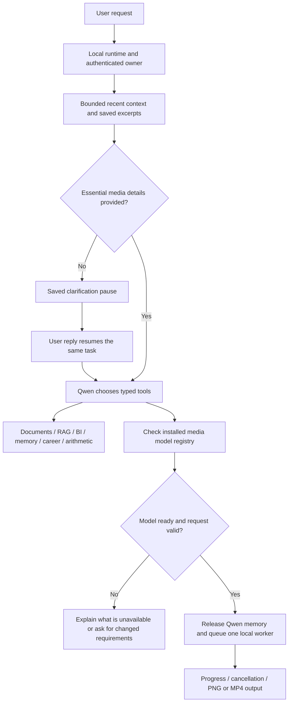

# Local agents and media

The local Workspace chat now uses Qwen with LangChain typed tools and LangGraph.
Media creation and task activity live inside Workspace at `/chat`. The local
General mode selector is removed; ordinary conversation also routes through
Workspace. Clarifications open a popup with suggested choices and a free-text
answer. Tasks and media are scoped to the authenticated application user.

These additions run only when `LOCAL_AGENT_ENABLED=true`, `AI_RUNTIME=local`,
and `APP_ENV` is not production. Cloud and production always return 404 for the
new task/media endpoints, even if the feature flag is accidentally enabled.
Their capabilities endpoint returns only `{"enabled": false}`. Existing cloud
Workspace routing and streaming use their existing implementation.

## Flow



Qwen selects existing task tools; each specialized tool retains its configured
task model and validation. RAG retains verified source IDs, user-owned retrieval,
clarification, abstention, and bounded retries. Qwen selects a media model ID from
the fixed readiness registry; application validation checks the ID again before
generation. Registry entries do not imply a downloaded model is runnable.

Explicit image/video requests cannot be dispatched to ordinary chat. The graph
checks missing visual style, size/shape, and video timing before model execution.
Qwen can ask further focused questions using `ask_user`. Incomplete tool inputs
also pause, and invented/changed sizes, duration or fps require clarification.
Nothing is generated while a question is pending. Ordinary confirmations are
needed only when essential preferences need resolving, not for every request.

## Use it here

For this checkout's **Docker Compose** setup, start Ollama and Docker Desktop,
then use the local launcher:

```powershell
.\.venv\Scripts\python.exe scripts/start_local.py
```

It starts a Windows media worker in the background and runs `docker compose up --build -d`.
The first start creates a random worker token in the ignored `.env`. The Docker API
loads that token and connects through `host.docker.internal:5002`; the worker uses
the tested native CPU image and CUDA video environments. Open `http://localhost:3000`.

Alternatively, keep the worker running in one terminal and use your usual Compose
command in another (recreate the API after the first token is configured):

```powershell
.\.venv\Scripts\python.exe scripts/start_local_media_host.py
# In another terminal:
docker compose up --build
```

The host accepts token-authenticated requests from private/loopback addresses, with
no browser CORS access. It uses separate SQLite state; the Docker API owns user
permissions and transfers completed previews into its existing artifact store.
Cancellation waits for the host subprocess to stop. The CPU Docker image gains only
the local checkpoint adapter and process utility; CUDA/Diffusers stay on Windows.
The default Docker build, production Compose, and Render retain their cloud behavior.

A native API also works. Leave `LOCAL_MEDIA_WORKER_URL` blank; for a frontend preview
configured to use port 5001, start it with:

```powershell
$env:OLLAMA_BASE_URL = 'http://127.0.0.1:11434'
$env:PORT = '5001'
.\.venv\Scripts\python.exe -m apps.api.main
```

Open **Workspace** chat. Use **Create media** beside the message box for an image
or video form; submitting it adds the request and result to the current chat.
**Activity** shows this conversation's tasks and locally saved media, with
progress, cancellation, downloads, and output deletion. For example:

- `Make an image of a cat.` opens a popup for style and size. Pick suggested
  choices or write `Watercolor style, square 512 by 512. Keep the cat as the subject.`
- `Create a watercolor cat image, square 512 by 512.` can generate directly.
- `Use the calculator to work out 2 seconds multiplied by 8 fps.` uses arithmetic.
- `Use my documents to find the launch date and cite the source.` routes into RAG.
- `Create a photorealistic ocean video, landscape, 2 seconds.` selects the local
  LTX model and queues a silent preview at 704 × 512 and 25 fps when it is ready.

**Continue** resumes the same checkpoint. **Answer later** or closing the popup
keeps the task paused; **Answer pending question** or **Activity → Answer question**
reopens it. A paused question is recovered when that conversation is opened again.
Specialized RAG clarification also pauses the graph and opens this popup before
Qwen routes the user's answer back to document retrieval. Saved General chats
retain their messages when moved into local Workspace. Hosted chat mode behavior
is preserved.

The image weights and separate CPU media dependencies were installed in this
workspace during implementation. The API automatically finds `.venv-media` for
images. Videos use a separate CUDA environment: `.venv-video`, then the existing
`.venv-video-test`, or the explicit `LOCAL_VIDEO_PYTHON` override.
There are no hosted media API calls or model downloads during generation.

For another local checkout:

```powershell
.\.venv\Scripts\python.exe -m pip install -r requirements-local-agent.txt
.\.venv\Scripts\python.exe -m venv --system-site-packages .venv-media
.\.venv-media\Scripts\python.exe -m pip install -r requirements-local-media.txt
# If the parent environment has no torch, install CPU torch in .venv-media:
# .\.venv-media\Scripts\python.exe -m pip install torch==2.8.0 --index-url https://download.pytorch.org/whl/cpu
hf download stabilityai/sd-turbo --revision b261bac6fd2cf515557d5d0707481eafa0485ec2 --local-dir data/models/sd-turbo --include '*.json' '*.txt' 'text_encoder/model.fp16.safetensors' 'unet/diffusion_pytorch_model.fp16.safetensors' 'vae/diffusion_pytorch_model.fp16.safetensors' README.md --max-workers 2
.\.venv-media\Scripts\python.exe scripts/local_media_worker.py --probe
```

The parent API environment still needs the root requirements. The image download
is approximately 2.6 GB. Review the model's linked license in the media form before uses
beyond local experimentation. Model weights, environments, checkpoints, and
generated files are ignored by Git.

## Models and hardware

| Model | Local implementation | Current machine |
| --- | --- | --- |
| `sd-turbo` | Real text-to-image, two diffusion steps, PNG | Installed; CPU inference tested |
| `ltx-video-2b-distilled` | LTX 2B 0.9.6 distilled, eight steps, disk-backed transformer weights, framewise VAE, silent MP4 | Selected after real tests on the 4 GB RTX 3050; see [benchmark](video-model-benchmark.md) |

Images are limited to 262,144 pixels: square 512 × 512, landscape 640 × 384,
or portrait 384 × 640. Both dimensions must be multiples of 64. These are small
previews rather than arbitrary resolutions; SD Turbo works best around 512 × 512.

Video is an experimental local feature. Qwen handles questions and prompt preparation;
LTX generates the video. It uses the checkpoint's published eight-step noise schedule,
BF16 diffusion, disk-backed transformer offloading and framewise decoding. The real T5 encoder reads one
block at a time from local weights, with protected output projections kept in FP32.
Each new prompt is encoded before loading the video model; benchmark prompt embeddings
are never reused for user requests. All encoder shards must exist before the model is
reported ready. The video environment must have CUDA and BF16 support.

The form offers square 512 × 512, landscape 704 × 512 and portrait 512 × 704, with
1–6 seconds at a fixed 25 fps. API requests allow dimensions that are multiples of 64,
between 256 and 704, within 360,448 total pixels. LTX uses `8n+1` frames; rounding can
make the preview slightly longer (2 seconds becomes 57 frames, or 2.28 seconds).
The standalone benchmark tested 704 × 512 at 161 frames; the form's square and portrait
presets are supported pipeline shapes, not separately benchmarked quality claims.
Output is silent. Motion and geometry may be imperfect; longer clips need more RAM.
A watchdog stops video generation if available system RAM stays below the configured
768 MB reserve for five seconds. Cancellation stops the worker's full process tree.

For a new machine, install the CUDA worker and download the pinned components once:

```powershell
.\.venv\Scripts\python.exe -m venv .venv-video
.\.venv-video\Scripts\python.exe -m pip install --no-cache-dir torch==2.8.0 torchvision==0.23.0 --index-url https://download.pytorch.org/whl/cu128
.\.venv-video\Scripts\python.exe -m pip install --no-cache-dir -r requirements-local-video.txt
hf download Lightricks/LTX-Video --revision 8984fa25007f376c1a299016d0957a37a2f797bb --local-dir data/models/ltx-video --include ltxv-2b-0.9.6-distilled-04-25.safetensors --max-workers 1
hf download Lightricks/LTX-Video-0.9.5 --revision e58e28c39631af4d1468ee57a853764e11c1d37e --local-dir data/models/ltx-video/config --include '*.json' --max-workers 2
hf download zai-org/CogVideoX-2b --revision 1137dacfc2c9c012bed6a0793f4ecf2ca8e7ba01 --local-dir data/models/ltx-video/text --include 'text_encoder/*.json' 'text_encoder/*.safetensors' 'tokenizer/*' --max-workers 2
.\.venv-video\Scripts\python.exe scripts/local_media_worker.py --probe
```

The compatible CogVideoX T5-v1.1-XXL weights are the same encoder source used in the
benchmark. Video weights total about 16 GB, including the 9.5 GB text encoder. Store
the text folder on a drive with space and set `LOCAL_VIDEO_TEXT_PATH` accordingly.
If the Hub CLI stalls on encoder shards, retry them using
`scripts/download_video_text_encoder.py --output <text-folder>` in the video environment;
it resumes bounded transfers and verifies the official SHA-256 checksums.
No paid GPU service is used. Generation stays offline.

## Context, persistence and limits

- Default planner context: 4,096 tokens, thinking disabled, up to 512 output tokens
  per planner call. Token estimates include schemas and use a conservative
  character estimate; they are not the model's exact tokenizer.
- History is retrieved for the current user/session. Older message excerpts form
  a persistent, **lossy extractive digest**, plus recent turns and explicit saved
  facts. No extra summarization model call is made. Long context is shortened before
  planning; a request that still does not fit is rejected. Documents, facts and
  history are treated as untrusted content. Clearing session memory clears its digest.
- Six planner calls and eight tools per task, including all clarification resumes.
  Specialized RAG/BI/general tools have their own existing inference and validation
  limits; planner-call counts do not include those internal calls.
- Four active queued/running agent tasks and four global queued/running media jobs.
  Each process has one agent execution thread; a SQLite claim permits only one
  media worker across API processes sharing the same local state.
- Media runs in a subprocess with a 30-minute queue/execution budget, a 2 GB
  output-storage admission limit, and cancellation/timeout termination. A pending
  Ollama call may finish before cancellation stops further tool execution.
- The orchestrator remains warm while planning and is unloaded before media
  generation to free memory. The existing `OLLAMA_NUM_GPU` setting is respected.
  Subsequent Workspace tasks wait while a video is queued or running so Qwen
  does not reload during video generation. Activity shows this waiting status;
  the task can still be cancelled.
- SQLite checkpoints survive process exit. Paused tasks resume from the Workspace
  popup or the next reply in the same chat. Completed tasks cannot be resumed twice.
  Media enqueueing is idempotent across checkpoint replay. Stale queued/running
  tasks are marked interrupted after their lease expires; generation and other
  side effects are not automatically replayed after a crash.
- Local state is separate from the configured application PostgreSQL/SQLite schema.
  No hosted database migration is added. LangSmith tracing is disabled for the graph.

Inline media previews survive a conversation reload. Owner- and session-checked
task references are stored in local SQLite beside the existing chat database;
the application database schema is unchanged. Loading a saved chat resolves the
current job status and paused question from local state. Deleted outputs disappear
from inline cards. Durable generation history and artifacts are also in Workspace
Activity.

## Configuration

Defaults and every override are listed in `.env.example`. Common settings:

```dotenv
LOCAL_AGENT_ENABLED=true
LOCAL_AGENT_MODEL=qwen3:8b
LOCAL_AGENT_CONTEXT_TOKENS=4096
LOCAL_AGENT_PATH=data/cache/local_agent
LOCAL_MEDIA_PATH=data/cache/local_media
LOCAL_MEDIA_PYTHON=
LOCAL_MEDIA_WORKER_URL=
LOCAL_MEDIA_WORKER_TOKEN=
LOCAL_MEDIA_DEVICE=cpu
LOCAL_IMAGE_MODEL_PATH=data/models/sd-turbo
LOCAL_VIDEO_PYTHON=
LOCAL_VIDEO_MODEL_PATH=data/models/ltx-video/ltxv-2b-0.9.6-distilled-04-25.safetensors
LOCAL_VIDEO_CONFIG_PATH=data/models/ltx-video/config
LOCAL_VIDEO_TEXT_PATH=data/models/ltx-video/text
LOCAL_VIDEO_OFFLOAD_PATH=data/cache/local_video_offload
LOCAL_MEDIA_MIN_AVAILABLE_RAM_MB=768
```

Blank `LOCAL_MEDIA_PYTHON` uses `.venv-media` if present; otherwise it uses the API
interpreter. Set an absolute interpreter path for a different media environment.
Local features default off in test environments; tests opt in explicitly.
Video automatically uses CUDA in its separate environment, even when images use CPU.
This checkout's ignored `.env` points to the tested LTX checkpoint/configuration on C:
and the restored text encoder on D:, so no second copy of the video checkpoint is needed.
Compose overrides the blank worker URL with `http://host.docker.internal:5002`.
Windows model/interpreter paths are read by the host worker and are never executed
inside the Linux API container.
LTX prepares a reusable disk offload cache on its first generation (approximately
3.6 GiB in `LOCAL_VIDEO_OFFLOAD_PATH`). Subsequent requests reuse it; interrupted
cache creation is checked and rebuilt before inference. This reduces RAM pressure
when Docker and the local video model run together. Failed host worker logs remain
in `data/cache/local_media_host/outputs` for diagnosis.
This checkout stores that cache on D: beside the encoder, preserving space on C:.

## Validation

Automated coverage includes typed-tool rejection, real graph transitions,
SQLite reopen/resume, budgets across resume, explicit preference checks, safe
arithmetic, tenant isolation, global media queue admission, cancellation/timeouts,
artifact access/deletion, authenticated API routing, and cloud/production denial.
Frontend checks cover forms, unavailable models, persistent clarification UI,
specialized-agent metadata, polling, and existing cloud response compatibility.

On October 9, 2026, the complete backend suite in the rebuilt CPU Docker image
reported **393 passed, 8 skipped**, with **74.04% coverage**. This check used isolated
SQLite state; PostgreSQL integration checks need `TEST_POSTGRES_URL`. The frontend
passed **102 tests**, type checking, the production build, and its dependency audit.

Recorded on October 8, 2026: **170 backend tests**, **100 frontend tests**, frontend
type checking and the production build passed. The local Workspace and clarification
popup were checked in an isolated browser preview. The real-model smoke run passed
**5/5 cases**:

The final browser check also generated a real SD Turbo image through the Workspace
media form, restored its completed inline card after a reload, and recovered a
paused clarification after closing the popup and reloading. Model IDs are required
tool arguments for Qwen to resolve internally, rather than questions for the user.

| Live case | Result | CPU time |
| --- | --- | --- |
| Native arithmetic | Tool result: 16 frames | 41.1 s |
| Missing image preferences | Durable pause; no generation | 1.0 s |
| Reopened pause + real image | Watercolor cat, 512 × 512 PNG | 84.2 s including planning/model checks |
| Unavailable video | Registry reason; no generation | 54.1 s |
| Orchestrated RAG | 22 October 2026 with `[cedar-handbook.md]` | 80.3 s |

The first clarification is an application preflight; subsequent tool calls,
model selection and RAG dispatch used real Qwen. A separate direct SD Turbo test
also generated a 512 × 512 red panda image, with approximately six seconds spent
in the two diffusion steps (model/process startup adds time). These timings are
examples from this machine, not latency guarantees.

Repeat the live smoke run with Ollama running:

```powershell
.\.venv\Scripts\python.exe scripts/test_local_workflows.py
```

It uses real `qwen3:8b`, cached MiniLM embeddings, downloaded SD Turbo weights,
and a new synthetic document index/database. It exercises arithmetic, a durable
media question/resume, actual PNG generation, unavailable-video handling, and
orchestrated RAG with an unrelated user's private chunk excluded. Results are
written to `data/cache/local_workflows/live-report.json`. This is a small smoke
test, not a broad quality, throughput or GPU/video benchmark. Its unavailable-video
case temporarily selects a missing checkpoint, so installing LTX does not invalidate it.

Run the real Qwen → LTX integration check separately, with Ollama running:

```powershell
.\.venv\Scripts\python.exe scripts/test_local_video.py
# Exercise the same HTTP bridge used by Docker, with the Windows host running:
.\.venv\Scripts\python.exe scripts/test_local_video.py --host-worker
```

This uses a new beach prompt, the real encoder and video worker, isolated SQLite state,
and owner/persistence checks. Its report and MP4 are saved in
`data/cache/local_video_smoke`. GPU tests should run one at a time.
The native check's new 704 × 512 beach prompt completed through Qwen and LTX
in 151 seconds on October 9, with 1,328 MiB minimum available system RAM. It
unloaded Qwen before generation, checked every MP4 frame, and verified owner
isolation and durable artifact state. The transformer is released before VAE
decoding to avoid overlapping their memory peaks.

The final Docker integration used the Windows host worker and reusable disk cache
and passed in 123.85 seconds, including Qwen planning and authenticated artifact
transfer. Its report is `data/cache/local_video_smoke/docker-report.json`. It
produced a real 704 × 512, 57-frame MP4 from a freshly encoded prompt, with owner
isolation and SQLite reopen checks. These small integration runs do not establish
latency or reliability while heavy applications are using the laptop; resource
contention can slow inference or trigger the RAM guard.

Primary references: [LangGraph interrupts](https://docs.langchain.com/oss/python/langgraph/interrupts),
[Ollama model lifetime](https://docs.ollama.com/api/generate),
[SD Turbo model](https://huggingface.co/stabilityai/sd-turbo),
[LTX pipeline](https://huggingface.co/docs/diffusers/v0.35.0/en/api/pipelines/ltx_video),
[distilled settings](https://github.com/Lightricks/LTX-Video/blob/main/configs/ltxv-2b-0.9.6-distilled.yaml).
